# 🌸 Petal Notes — Full Stack Notes Management App  

A simple yet powerful note-taking solution built to streamline everyday note management with an intuitive interface and practical features.  

---  

## 🌐 Live Demo

🚀 Experience the app live:  
👉 **[Open Petal Notes](https://petal-notes-production.up.railway.app)**  

> ⚠️ Note: The app may take a few seconds to load initially (free hosting).

--- 

## 📌 1. Project Overview  

**Petal Notes** is a full-stack web application that allows users to create, manage, organize, and store their personal notes efficiently. The application provides a clean and modern interface combined with a robust backend system supporting features like soft delete (trash), pinning, categorization, and search. It is built using a server-rendered architecture with a strong focus on clean code, scalability, and real-world backend practices.  

---  

## 🎯 2. Objectives  

- Build a real-world full-stack application from scratch  
- Practice backend architecture using Node.js and Express  
- Implement CRUD operations with MongoDB  
- Apply soft delete (trash system) and permanent deletion  
- Implement pin/unpin functionality with sorting logic  
- Build category-based filtering system  
- Implement search functionality  
- Learn session-based authentication  
- Apply centralized error handling  
- Prepare a deployment-ready project  

---  

## 🚀 3. Features  

### 🎨 Frontend Features  

#### 🧩 UI & Layout  
- Clean, modern, and minimal user interface  
- Fully responsive design (mobile + desktop)  
- Sidebar navigation with clearly organized sections and collections  
- Dynamic greeting messages on the dashboard for better user experience  

---

#### 📝 Notes Display  
- Grid-based layout for structured note visualization  
- Each note displays:
  - Title  
  - Description preview  
  - Category tag  
  - Last updated date  
- Hover-based action controls for quick interactions (Edit, Delete, Pin)  

---

#### 📂 Category Filtering  
- Dedicated pages for:
  - Work  
  - Personal  
  - Ideas  
- Displays only notes belonging to the selected category  
- Helps users organize and quickly access relevant notes  

---

#### 📌 Pin System (UI)  
- Notes can be pinned/unpinned directly from the UI  
- Pinned notes are visually highlighted  
- Automatically moved to the top of the list  
- Dedicated **Pinned Notes page** for quick access to important notes  

---

#### 🗑️ Trash & Restore System (UI)  
- Soft delete functionality (notes are not immediately removed)  
- Dedicated Trash page to manage deleted notes  
- Users can:
  - ♻️ Restore notes back to their original state  
  - ❌ Permanently delete notes  
- Clear visual distinction between active and trashed notes  

---

#### 🔍 Search Feature (UI)  
- Search bar available on dashboard  
- Instantly filters notes based on user input  
- Displays matching results dynamically  
- Shows a user-friendly message when no results are found  

---

#### ⚠️ Error Handling (UI)  
- Inline error messages for form validation  
- Clear and user-friendly feedback  
- Preserves user input when validation fails  

---

### ⚙️ Backend Features  

#### 🔐 Authentication System  
- User registration and login functionality  
- Passwords securely hashed using bcrypt  
- Session-based authentication system  
- Route protection using authentication middleware  

---

#### 🧠 Notes Management (CRUD)  
- Create new notes  
- Read/view notes across different pages  
- Update existing notes  
- Soft delete (move to trash)  
- Permanently delete notes from database  

---

#### 🗑️ Soft Delete & Restore Logic  
- Notes are not deleted immediately — marked using `isTrashed` flag  
- Enables recovery of accidentally deleted notes  
- Restore operation moves notes back to active state  
- Permanent deletion removes notes completely from database  

---

#### 📌 Pinning Logic  
- Toggle pin/unpin functionality  
- Sorting logic ensures:
  - Pinned notes appear first  
  - Remaining notes sorted by latest creation date  
- Maintains intuitive and consistent ordering  

---

#### 📂 Category Filtering (Backend)  
- Efficient query-based filtering using MongoDB  
- Retrieves notes based on selected category  
- Ensures only relevant notes are returned per request  

---

#### 🔍 Search Functionality  
- Search across:
  - Note title  
  - Note description  
- Case-insensitive matching using RegEx  
- Integrated within dashboard route for seamless experience  

---

#### 🔁 Dynamic Redirect System  
- After actions (edit, delete, pin), user is redirected back to the same page  
- Maintains context (e.g., category page, pinned page)  
- Implemented using `redirectTo` query parameter  

---

#### ⚠️ Centralized Error Handling  
- Custom `AppError` class for structured errors  
- Global error handling middleware  
- Handles:
  - Validation errors  
  - Database errors  
  - Custom application errors  
- Context-aware rendering using request metadata (`req.errorPage`)  

---

## 🛠️ 4. Tech Stack  

### 🎨 Frontend  
- HTML5  
- CSS3  
- EJS (Embedded JavaScript Templates)  
- JavaScript (Vanilla)  

### ⚙️ Backend  
- Node.js  
- Express.js  

### 🗄️ Database  
- MongoDB Atlas (Cloud Database)  
- Mongoose (ODM)  

### 🔐 Authentication / Tools  
- express-session  
- bcrypt  
- dotenv  
- Git & GitHub  

---  

## 📁 5. Project Structure  

```  
project-root/  
│
├── controllers/        # Business logic  
├── models/             # Database schemas  
├── routes/             # Application routes  
├── middleware/         # Auth & error middleware  
├── public/             # Static assets  
│   ├── styles/  
│   ├── scripts/  
│   └── images/  
├── views/              # EJS templates  
│   ├── auth/  
│   └── notes/  
├── utils/              # Utilities (AppError etc.)  
├── .env  
├── app.js  
└── package.json  
```  

---  

## ⚙️ 6. Installation / Setup  

```bash  
git clone <your-repo-link>  
cd project-folder  
npm install  
```  

---  

## ▶️ 7. Running the Project  

```bash  
npm start  
```  

App runs on:  

```  
http://localhost:3000  
```  

---

## 🔗 8. Application Routes  

### 🧾 Notes Routes  

| Method | Endpoint      | Description           |  
|--------|---------------|-----------------------|  
| GET    | /dashboard    | Show all notes        |  
| GET    | /new          | Show create note form |  
| POST   | /             | Create note           |  
| GET    | /:id/edit     | Show edit form        |  
| POST   | /:id          | Update note           |  
| POST   | /:id/trash    | Move to trash         |  
| POST   | /:id/delete   | Permanent delete      |  
| POST   | /:id/restore  | Restore note          |  
| POST   | /:id/pin      | Toggle pin            |  

### 📂 Filter Routes  

| Method | Endpoint      | Description    |  
|--------|---------------|----------------|  
| GET    | /work         | Work notes     |  
| GET    | /personal     | Personal notes |  
| GET    | /ideas        | Ideas notes    |  
| GET    | /pinned-notes | Pinned notes   |  
| GET    | /trash-page   | Trash page     |  

### 🔐 Auth Routes  

| Method | Endpoint   | Description        |  
|--------|---------   |--------------------|  
| GET    | /register  | Show register page |  
| POST   | /register  | Register user      |  
| GET    | /login     | Show login page    |  
| POST   | /login     | Login user         |  
| GET    | /logout    | Logout user        |  

---  

## 🔒 9. Security Considerations  

- Passwords hashed using bcrypt  
- Session-based authentication  
- Protected routes using middleware  
- Environment variables used for sensitive data  
- MongoDB secured with credentials  
- Input validation and sanitization  
- No sensitive data exposed to frontend  

---  

## 🔮 10. Future Improvements  

- Pagination for notes  
- Rich text editor  
- Tagging system  
- Note sharing feature  
- REST API version  
- Improved search (fuzzy search / indexing)  
- User profile management  

---  

## 📸 11. Screenshots

### 🏠 Home Page
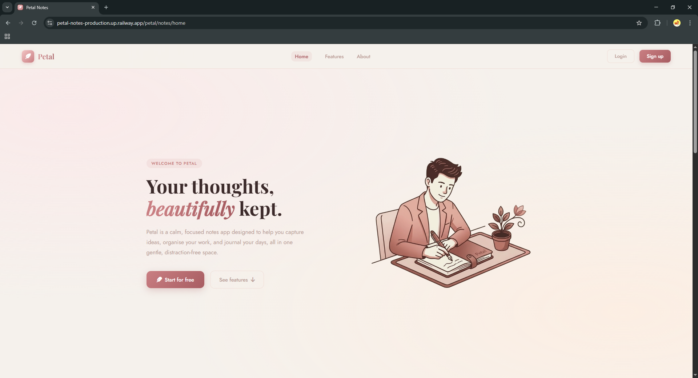

### 🧾 User Registration
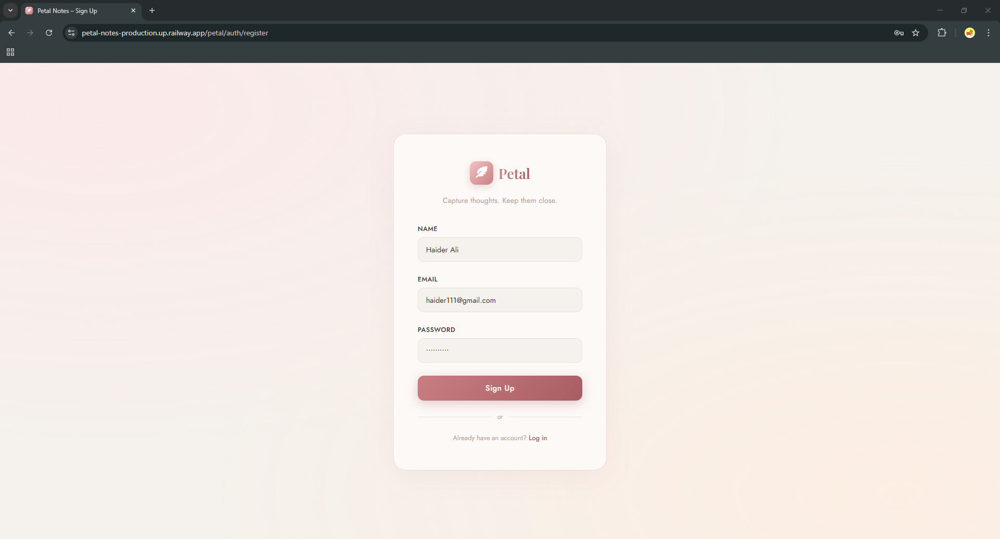

### 👤 User Created
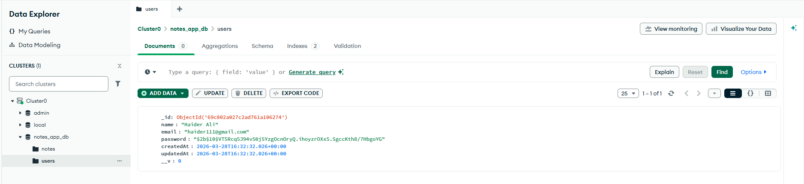

---

### 📊 Dashboard States

#### 📭 Empty Dashboard
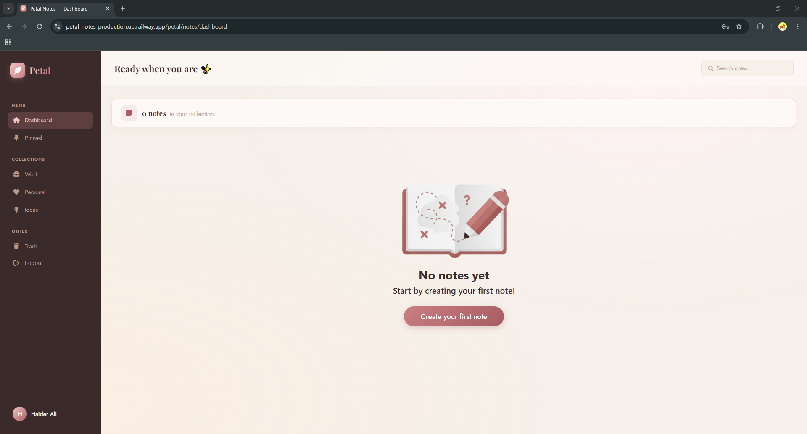

#### ➕ Create Note
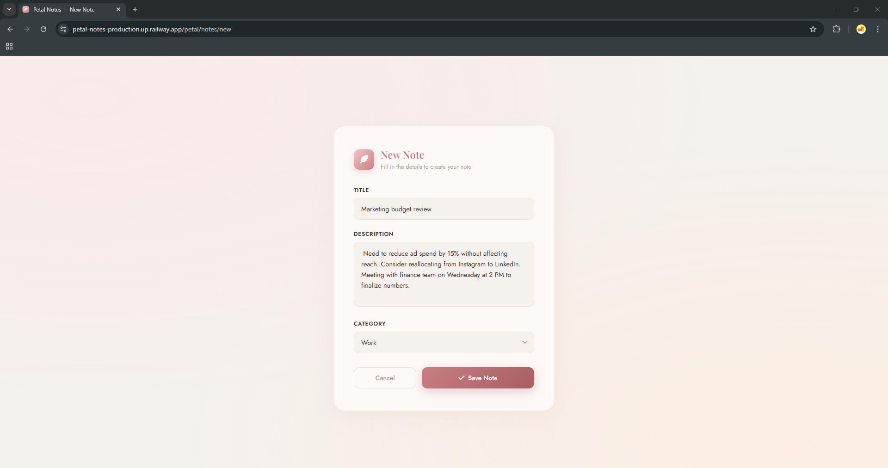

#### 📄 Notes Created
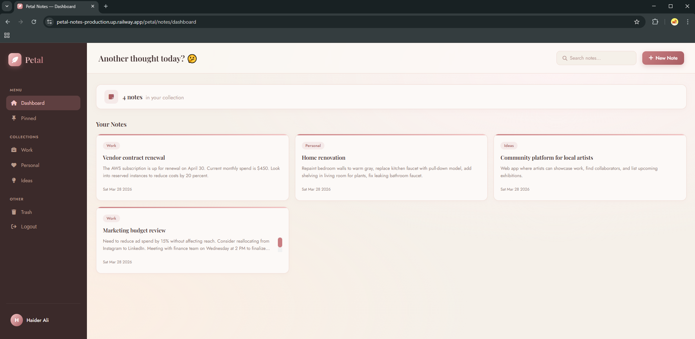

---

### ✏️ Edit & Update

#### 📝 Edit Note
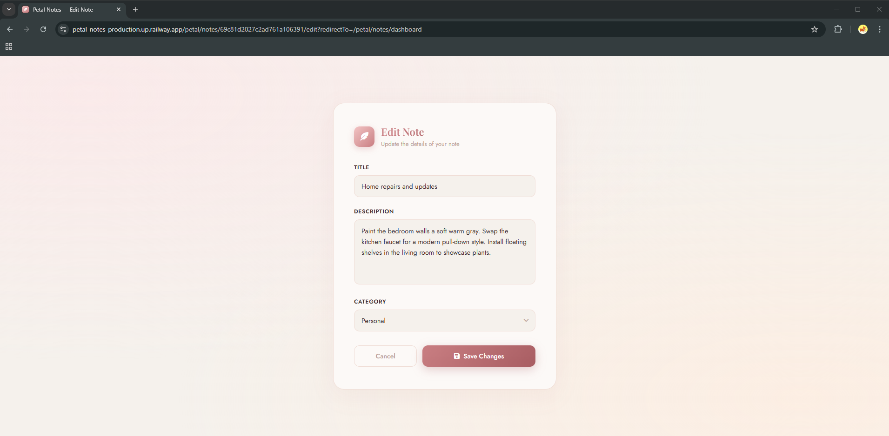

#### ✅ Note Updated
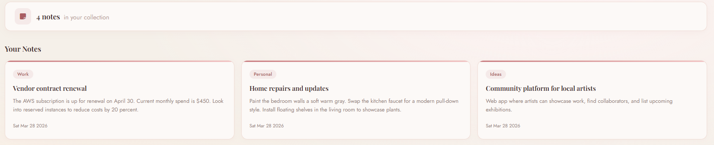

---

### 📌 Pin Feature

#### 📍 Pin Note
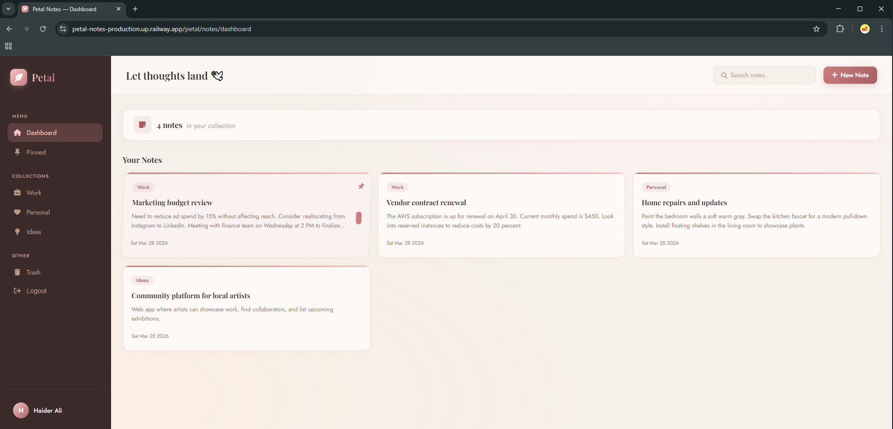

#### 📑 Pinned Notes Page
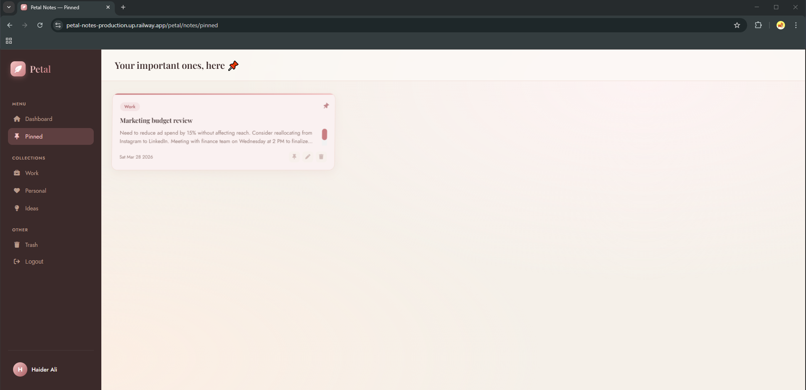

---

### 🔍 Search Feature

#### 📋 Search Results
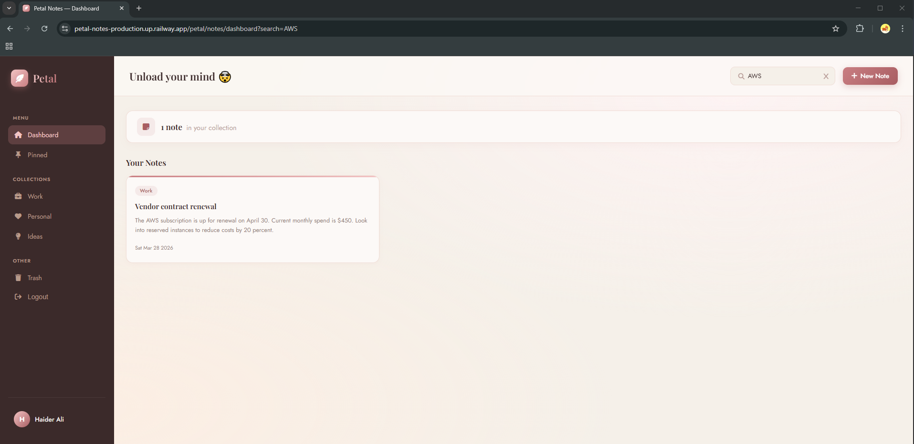

#### ❌ No Results Found
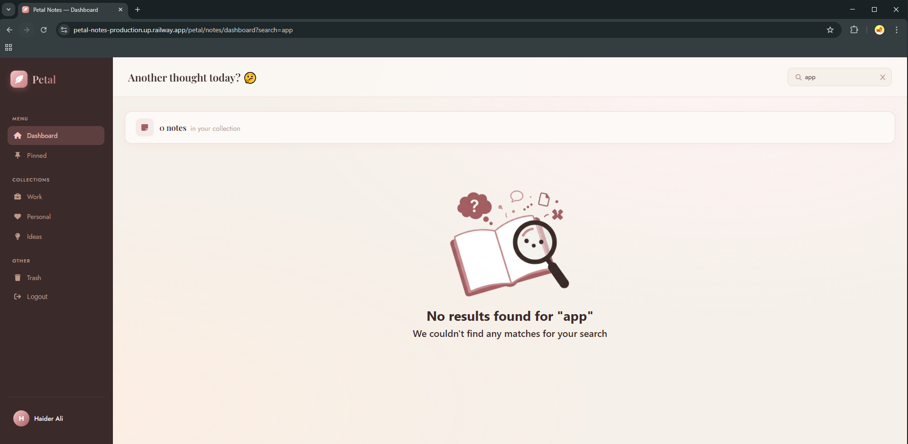

---

### 📂 Collections

#### 💼 Work Collection
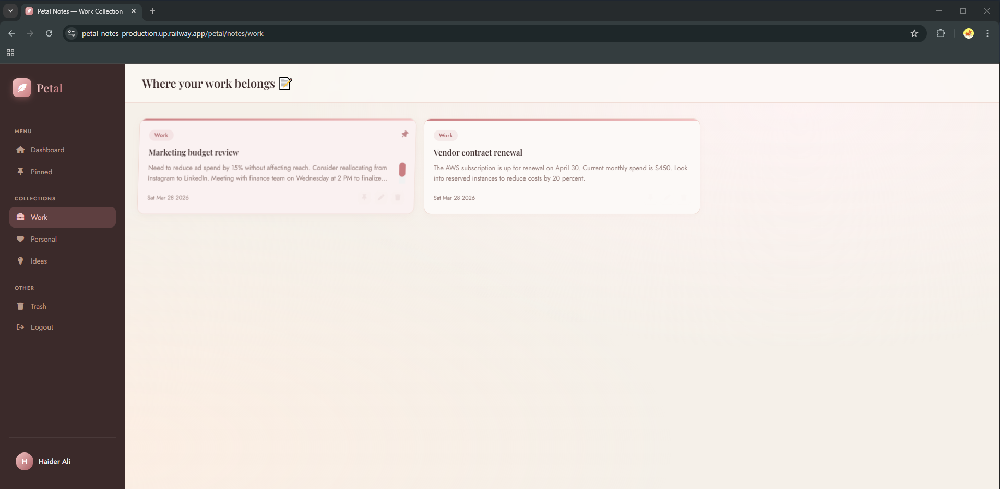

---

### 🗑️ Trash & Restore Management

#### ↪ Move to Trash
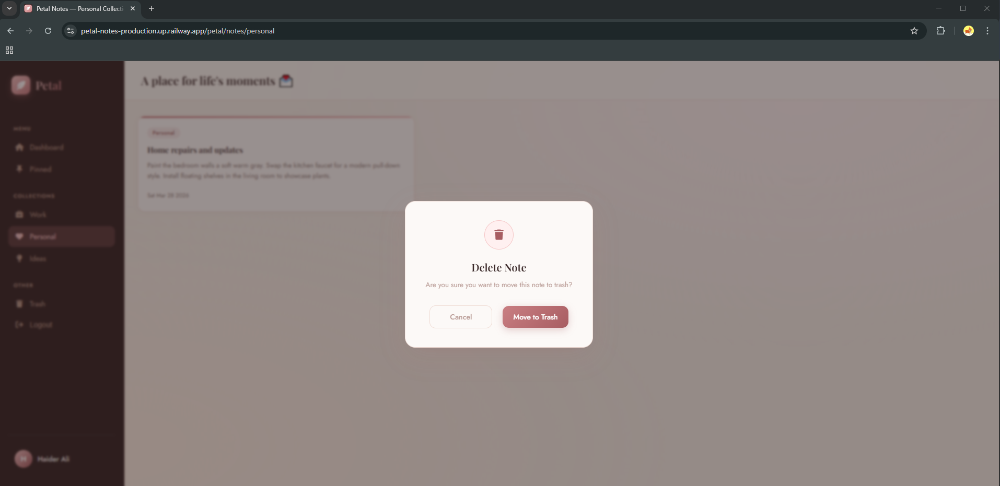

#### 📂 Trash Page
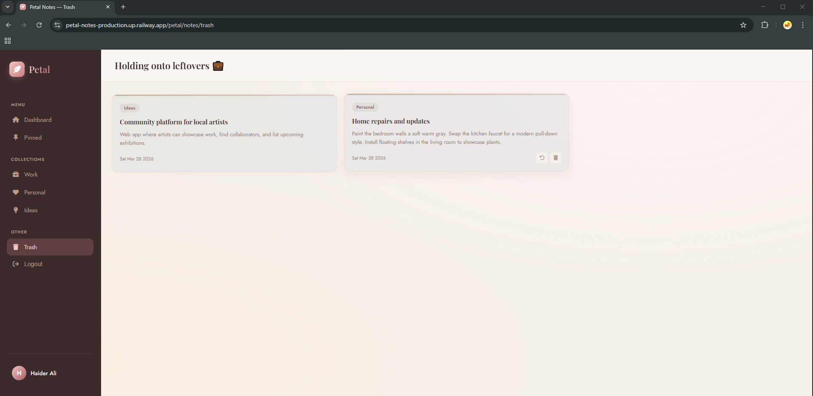

#### ♻️ Restore Note
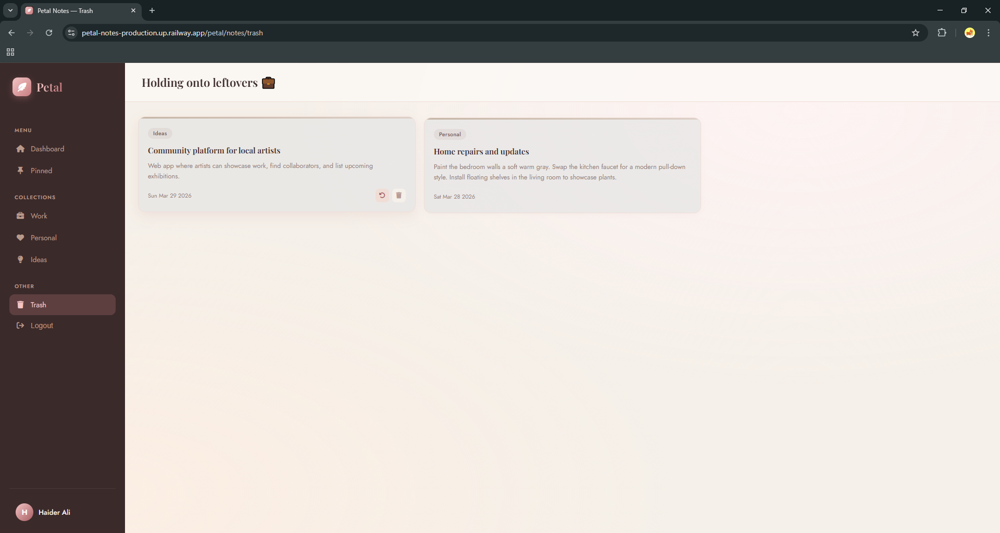

#### ❌ Permanent Delete
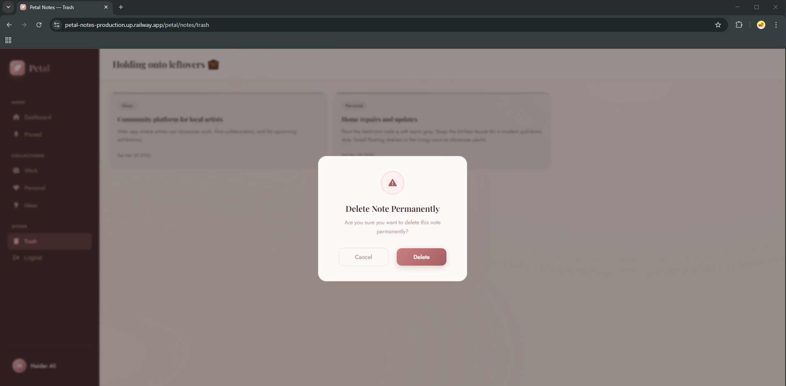

---

### 📱 Responsive Design

#### 🏠 Mobile Home Page View


#### 📊 Mobile Dashboard View


---  

## 👨‍💻 12. Author / Contact  

**Developer:** Syed Muhammad Abbas  

- 📧 Email: abbas63891@gmail.com  
- 💼 LinkedIn: https://linkedin.com/in/syed-muhammad-abbas-07831437b  
- 🐙 GitHub: https://github.com/MdAbbas762  

> Feel free to reach out for collaboration, feedback, or opportunities.  

---  